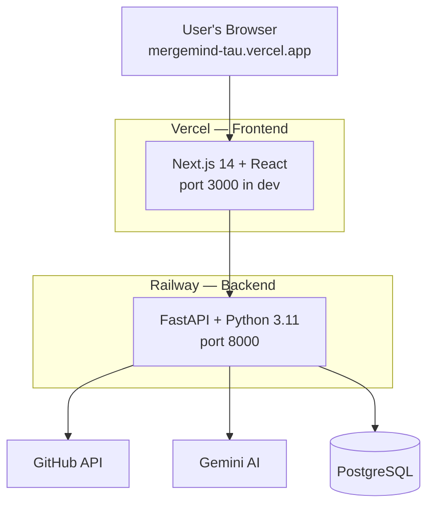

# MergeMind — Architecture

## System overview



<br>

## Frontend (Next.js App Router)

```text
app/
├── layout.tsx                    # root layout: SessionProvider, Navbar
├── page.tsx                      # landing page
├── login/page.tsx                # OAuth sign-in
├── dashboard/page.tsx            # user stats + daily pick
├── discover/page.tsx             # repo search, two-column grid
├── portfolio/page.tsx            # user's repos + stats
├── repo/[owner]/[repo]/
│   ├── page.tsx                  # repo detail + health scores
│   └── issues/
│       ├── page.tsx              # issues list
│       └── [number]/page.tsx     # issue detail + AI analysis
└── api/auth/[...nextauth]/
    └── route.ts                  # NextAuth config, GitHub provider
```

**Component tree:** `SessionProvider` wraps the entire app → `CommandPaletteProvider` (Cmd+K search) → `Navbar` (navigation + user menu) → page content.

**Data flow:** page loads → `useEffect` → `fetch(API + "/endpoint")` → `setState` → render. On error, `setError` renders an `ErrorDisplay` component instead.

<br>

## Backend (FastAPI)

### Middleware pipeline

Every request passes through, in order:

1. `GZipMiddleware` — compresses responses over 500B
2. `CORSMiddleware` — allows the Vercel origin only
3. Rate limiting — 100 requests / 60s per IP
4. Security headers — XSS, clickjacking, MIME sniffing protection
5. Request logging — structured JSON to stdout
6. Router
7. Response

### Router → service → external calls

| Router | Service | External |
|---|---|---|
| `auth.py` | JWT verification (inline) | NextAuth |
| `github.py` | `github_client.py` | GitHub API |
| — | `ai_service.py`, `health_scorer.py` | Gemini AI |
| `portfolio.py` | `portfolio_service.py` | GitHub API |
| `dashboard.py` | `dashboard_service.py` | GitHub API |
| `recommendations.py` | `recommendation_engine.py` | GitHub + Gemini |
| `history.py` | SQLAlchemy (inline) | PostgreSQL |

<br>

## Authentication flow

1. User clicks "Sign in with GitHub"
2. NextAuth redirects to `github.com/login/oauth/authorize`
3. User authorizes → GitHub redirects to `/api/auth/callback/github`
4. NextAuth exchanges the code for an access token
5. NextAuth creates a JWT session cookie (HS256, signed with `NEXTAUTH_SECRET`)
6. Frontend reads the session via the `useSession()` hook
7. API calls send the cookie automatically (same-origin)
8. Backend (`auth.py`) verifies the JWT signature with HMAC-SHA256
9. Username is extracted from the verified payload
10. Returns `401` if the token is invalid, missing, or expired

<br>

## GitHub API request flow

A request to, e.g., `/api/github/repositories/{owner}/{repo}` goes through `github_client.request(url, params)`:

1. Check the in-memory cache (5-minute TTL) — on a hit, return cached data immediately
2. Check the rate limit via `X-RateLimit-Remaining` — if close to the limit, wait until reset
3. Make the HTTP request (pooled connections, 30s timeout)
   - `200` → parse JSON, cache it, return
   - `404` → return `None`
   - `429` → wait for `Retry-After`, then retry
   - `5xx` → exponential backoff, up to 3 attempts
   - anything else → raise `HTTPException`
4. If all retries are exhausted → `502 Bad Gateway`

<br>

## AI scoring flow

Triggered by `GET /api/recommendations/top`:

1. Get the user's languages from GitHub, if authenticated
2. Fetch issues from curated repos in parallel (`asyncio.gather`)
3. For each repo:
   - fetch issues and repo data simultaneously
   - calculate a health score (activity, docs, community, maintenance)
   - check for `good first issue` labels
   - generate an AI reason via Gemini (10-minute cache)
4. Return the top N recommendations
5. Store results in `recommendation_history`, deduplicated

<br>

## Database schema

**`users`**
`id` (PK) · `github_id` (unique) · `username` (unique) · `preferred_languages` (JSON) · `interests` (JSON) · `onboarding_completed`

**`cached_repositories`**
`id` (PK) · `full_name` (unique) · `health_score` · `health_categories` (JSON) · `ai_summary` · `cache_expires_at`

**`cached_issues`**
`id` (PK) · `github_id` (unique) · `repository_full_name` · `difficulty_score` · `verdict` · `cache_expires_at`

**`recommendation_history`**
`id` (PK) · `user_id` (FK → `users.id`) · `issue_github_id` · `was_viewed` · `was_clicked` · `was_contributed`

<br>

## Request lifecycle

1. Browser sends a request to Vercel (Next.js)
2. Next.js serves the page (SSR or static)
3. Page loads, `useEffect` fires
4. `fetch()` call goes to the Railway backend
5. Railway middleware pipeline runs: GZip decompression → CORS validation → rate limit check → security headers → request logged
6. Router matches the endpoint
7. Auth dependency checks the JWT, if required
8. Service layer processes the request
9. GitHub, Gemini, or DB calls happen as needed
10. Response returns back through the middleware
11. Frontend receives JSON, updates state, re-renders

<br>

## Caching strategy

| What | Where | TTL | Key |
|---|---|---|---|
| GitHub API responses | Backend memory | 5 min | URL + params |
| Gemini AI responses | Backend memory | 10 min | `SHA256(prompt)` |
| Next.js pages | Vercel CDN | Auto | Route |
| Static assets | Vercel CDN | Auto | Filename hash |

<br>

## Security layers

- HTTPS (Vercel + Railway TLS termination)
- CORS, specific origins only
- Rate limiting — 100 req / 60s / IP
- JWT verification (HMAC-SHA256)
- Input sanitization (strip, validate)
- Security headers (XSS, clickjacking, MIME sniffing)
- No secrets in code — env vars only
- Production validation — refuses to start if misconfigured

<br>

## Development vs. production

| Aspect | Development | Production |
|---|---|---|
| Frontend | `localhost:3000` | `mergemind-tau.vercel.app` |
| Backend | `localhost:8000` | `railway.app` |
| Database | SQLite (file) | PostgreSQL |
| AI | Gemini (if key set) | Gemini (if key set) |
| Docs | `/docs` enabled | `/docs` disabled |
| Logging | INFO level | WARNING level |
| CORS | `localhost:3000` | `vercel.app` |
| HSTS | Disabled | Enabled |
