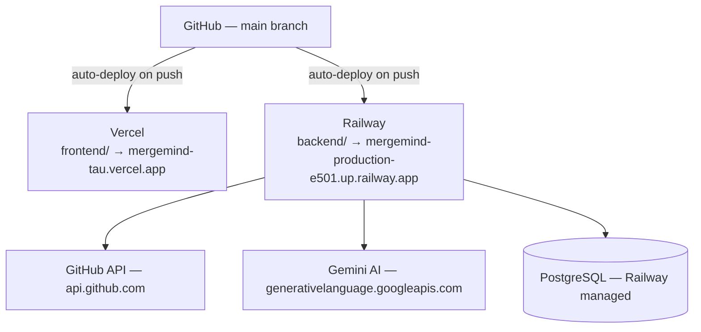

# MergeMind — Deployment Guide

## Architecture



<br>

## Local setup

### Option 1 — Docker (recommended)

```bash
git clone https://github.com/BistaDinesh03/mergemind.git
cd mergemind

# backend/.env
cat > backend/.env << EOF
GITHUB_TOKEN=ghp_your_token_here
DATABASE_URL=sqlite:///./mergemind.db
GITHUB_CLIENT_ID=your_client_id
GITHUB_CLIENT_SECRET=your_client_secret
SECRET_KEY=your-secret-key-at-least-32-characters
NEXTAUTH_SECRET=your-nextauth-secret
GEMINI_API_KEY=your_gemini_key  # optional
EOF

# frontend/.env.local
cat > frontend/.env.local << EOF
NEXT_PUBLIC_API_URL=http://localhost:8000
NEXTAUTH_URL=http://localhost:3000
NEXTAUTH_SECRET=your-nextauth-secret
GITHUB_CLIENT_ID=your_client_id
GITHUB_CLIENT_SECRET=your_client_secret
EOF

docker compose up -d
```

- Frontend: `http://127.0.0.1:3000`
- Backend: `http://127.0.0.1:8000`
- API docs: `http://127.0.0.1:8000/docs`

### Option 2 — Manual

```bash
# backend
cd backend
python -m venv venv
source venv/bin/activate  # Windows: venv\Scripts\activate
pip install -r requirements.txt
uvicorn app.main:app --reload --host 127.0.0.1 --port 8000

# frontend, new terminal
cd frontend
npm install
npm run dev
```

### Docker commands

```bash
docker compose up -d                          # start all services
docker compose logs -f backend                # view backend logs
docker compose logs -f frontend                # view frontend logs
docker compose build --no-cache backend        # rebuild after code changes
docker compose up -d backend
docker compose down                             # stop everything
docker compose ps                               # check status
docker inspect mergemind-backend-1 --format '{{.State.Health.Status}}'
```

<br>

## Vercel deployment (frontend)

**Initial setup**

1. Go to [vercel.com/new](https://vercel.com/new)
2. Import `BistaDinesh03/mergemind` from GitHub
3. Configure: Framework → Next.js, Root Directory → `frontend`, Build Command → `npm run build`, Output Directory → `.next`
4. Add environment variables (see below)
5. Deploy

**Auto-deploy:** Vercel deploys automatically on every push to `main`. Production URL: `https://mergemind-tau.vercel.app`

**Manual redeploy:** go to the [deployments page](https://vercel.com/bisu-s-projects/mergemind/deployments), click "Redeploy" on the latest deployment, and check "Clear cache and redeploy" if styles look stale.

<br>

## Railway deployment (backend)

**Initial setup**

1. Go to [railway.app/new](https://railway.app/new)
2. Select "Deploy from GitHub repo"
3. Choose `BistaDinesh03/mergemind`
4. Set Root Directory to `backend` — Railway auto-detects the Dockerfile
5. Add environment variables (see below)
6. Deploy

**Auto-deploy:** Railway deploys automatically on every push to `main`. Production URL: `https://mergemind-production-e501.up.railway.app`

**Health check:** Railway uses `/health/live` as the health check endpoint — the container is marked healthy once this returns `200`.

<br>

## Environment variables

### Vercel (frontend)

| Variable | Required | Description |
|---|---|---|
| `NEXT_PUBLIC_API_URL` | Yes | `https://mergemind-production-e501.up.railway.app` |
| `NEXTAUTH_URL` | Yes | `https://mergemind-tau.vercel.app` |
| `NEXTAUTH_SECRET` | Yes | 32+ char random string |
| `GITHUB_CLIENT_ID` | Yes | From your GitHub OAuth App |
| `GITHUB_CLIENT_SECRET` | Yes | From your GitHub OAuth App |

### Railway (backend)

| Variable | Required | Description |
|---|---|---|
| `ENVIRONMENT` | Yes | `production` |
| `GITHUB_TOKEN` | Yes | GitHub personal access token |
| `GITHUB_CLIENT_ID` | Yes | From your GitHub OAuth App |
| `GITHUB_CLIENT_SECRET` | Yes | From your GitHub OAuth App |
| `SECRET_KEY` | Yes | 32+ char random string |
| `NEXTAUTH_SECRET` | Yes | Must match the Vercel value |
| `CORS_ORIGINS` | Yes | `https://mergemind-tau.vercel.app,http://localhost:3000` |
| `DATABASE_URL` | Yes | Auto-provisioned by Railway (PostgreSQL) |
| `GEMINI_API_KEY` | No | Optional — AI features fall back if missing |

**Local:** `backend/.env` and `frontend/.env.local` are gitignored. Use `.env.example` as a template.

<br>

## GitHub OAuth configuration

**Create the OAuth App:**

1. Go to [github.com/settings/developers](https://github.com/settings/developers) → "New OAuth App"
2. Fill in: Application name → `MergeMind`, Homepage URL → `https://mergemind-tau.vercel.app`, Authorization callback URL → `https://mergemind-tau.vercel.app/api/auth/callback/github`
3. Register, then generate a client secret
4. Copy the Client ID and Client Secret into both Vercel and Railway

**For local development:** create a separate OAuth App with Homepage URL `http://localhost:3000` and callback URL `http://localhost:3000/api/auth/callback/github`.

<br>

## Production checklist

- [ ] Vercel env vars set (all 5 required)
- [ ] Railway env vars set (all 7 required)
- [ ] GitHub OAuth App callback URL matches the Vercel production URL
- [ ] `CORS_ORIGINS` includes the Vercel URL
- [ ] Health check passes — `/health/live` returns `200`
- [ ] Login works end-to-end
- [ ] Dashboard loads user data
- [ ] Discover searches and filters repos
- [ ] Portfolio shows repositories
- [ ] No console errors in the browser
- [ ] SSL/HTTPS enabled (Vercel + Railway handle this automatically)

<br>

## Common deployment issues

**"Build Failed: No Next.js version detected"**
Root Directory isn't set to `frontend`. Fix it in Vercel project settings.

**"TypeError: Invalid URL" during build**
`NEXT_PUBLIC_API_URL` or `NEXTAUTH_URL` is empty. Set them in Vercel before building.

**"The redirect_uri is not associated with this application"**
The GitHub OAuth App's callback URL doesn't match the actual redirect. Update it to `{vercel_url}/api/auth/callback/github`.

**"GitHub authentication failed. Check API token"**
The GitHub personal access token expired or is invalid. Generate a new one at [github.com/settings/tokens](https://github.com/settings/tokens) with `repo` and `user` scopes.

**"Application failed to respond" on Railway**
The container crashed — check the deploy logs. Common causes: missing `DATABASE_URL`, using SQLite instead of PostgreSQL (Railway needs Postgres), or the app not listening on `$PORT`.

**"CORS error" in the browser console**
`CORS_ORIGINS` doesn't include the frontend URL. Add the exact Vercel URL to Railway's `CORS_ORIGINS`.

**Stale UI after deploy**
Browser or Vercel cache. Hard refresh (`Ctrl+Shift+R`) or redeploy with "Clear cache" checked.

**Dashboard shows 0 repos**
`NEXT_PUBLIC_API_URL` isn't set or is wrong. Verify it points to the Railway backend URL, including `https://`.

<br>

## Useful commands

```bash
# check production health
curl https://mergemind-production-e501.up.railway.app/health

# check frontend is serving
curl -I https://mergemind-tau.vercel.app

# view logs
railway logs --service mergemind
vercel logs --project mergemind

# test CORS
curl -I -X OPTIONS \
  -H "Origin: https://mergemind-tau.vercel.app" \
  -H "Access-Control-Request-Method: GET" \
  https://mergemind-production-e501.up.railway.app/api/github/repositories
```
