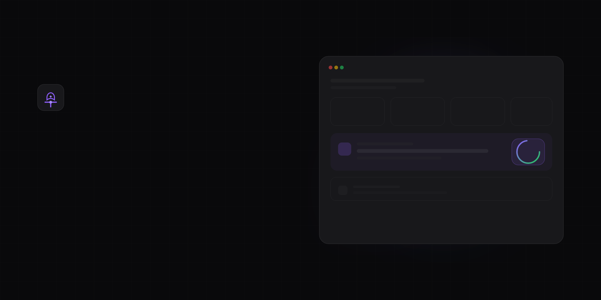

<div align="center">


<br />
<br />

# MergeMind

### Find your next contribution in seconds

Stop scrolling through thousands of issues. Get one clear recommendation backed by explainable scoring.



<br />

[](LICENSE)
[](https://nextjs.org)
[](https://fastapi.tiangolo.com)
[](https://python.org)
[](https://typescriptlang.org)
[](https://docker.com)
[]()
[]()

</div>

---

## Why MergeMind exists

Most developers want to contribute to open source. The intent is there. The time is there. What is missing is knowing *where to start*.

MergeMind connects that intent to the right issue. It scans repositories, scores every open issue across multiple dimensions, and gives you one clear recommendation. No endless tabs. No guesswork.

---

## The problem

You open GitHub looking for an issue to work on. What happens next is predictable.

You search for repositories. You open a dozen issues in new tabs. You read through each one. You try to figure out if the maintainers are active. You wonder if your PR will even get reviewed. After an hour, you close everything and try again next weekend.

Most developers never ship their first contribution. Not because they cannot code. Because the discovery process is broken.

---

## The solution

MergeMind does the searching and scoring for you. It looks at every open issue across the repositories that matter to you. It scores each one by difficulty, merge probability, how beginner-friendly it is, and whether the repository is healthy.

Then it gives you a single recommendation and explains exactly why that issue was chosen.

> *"Start with this one. It is small in scope. The maintainers merge PRs within 3 days. You will learn the codebase without getting stuck."*

---

## Key Features

| Feature | What it does |
|---------|-------------|
| **Issue scoring** | Every open issue gets a 0-100 score based on difficulty, merge chance, and clarity |
| **Repository health** | Know if a repo is actively maintained before you invest time |
| **Explainable recommendations** | Each pick includes the reasoning behind it — no black box |
| **Portfolio builder** | Your merged PRs become a shareable portfolio automatically |
| **Command palette** | Press Cmd+K to search repos instantly |
| **Accessible** | WCAG 2.2 AA compliant. Works with keyboard and screen readers |

---

## Screenshots

| Dashboard | Discover |
|:---:|:---:|
|  |  |

| Repository Analysis | Issue Scoring |
|:---:|:---:|
|  |  |

| Portfolio |
|:---:|
|  |

---

## How it works

**Connect your GitHub account.** Read-only access. No permissions beyond public data.

**Browse repositories.** Trending repos appear instantly. Filter by language or search directly.

**See repository health.** Each repo gets scored on activity, documentation, community, and maintenance.

**Get issue recommendations.** Issues are ranked by how well they match your skills and available time.

**Read the reasoning.** Every recommendation explains why that issue was chosen over others.

**Open it on GitHub.** One click takes you to the issue. Start coding.

---

## GitHub vs MergeMind

| What you need | Manual approach | With MergeMind |
|--------------|----------------|----------------|
| Find a beginner-friendly issue | Browse repos, open tabs, read descriptions. 45+ minutes | One dashboard view. Under 10 seconds |
| Know if a repo is maintained | Check commit history, open issues, discussion activity | Health score on every repository card |
| Predict if your PR will merge | Guess based on how recently issues were closed | Merge probability calculated from historical data |
| Build a portfolio | Manually track every PR you submit | Auto-generated from your GitHub activity |

---

## Tech Stack

| Layer | Technology |
|-------|-----------|
| Frontend | Next.js 14 · React 18 · TypeScript · Tailwind CSS |
| Backend | FastAPI · Python 3.11 · SQLAlchemy · Pydantic |
| Scoring engine | Ollama + Llama 3.2 (local, private, zero cost) |
| Authentication | NextAuth.js · GitHub OAuth 2.0 |
| Database | SQLite for development · PostgreSQL for production |
| Testing | pytest (16 tests) · Vitest · GitHub Actions CI |
| DevOps | Docker · Docker Compose |

---

## Quick Start

**Prerequisites:** Docker Desktop, GitHub account.

```bash
git clone https://github.com/BistaDinesh03/mergemind.git
cd mergemind
docker compose up -d
open http://localhost:3000
For detailed setup instructions, see DEPLOYMENT.md.

Project Structure
text
mergemind/
├── backend/              # FastAPI server
│   ├── app/routers/      # API endpoints
│   ├── app/services/     # Business logic + scoring engines
│   ├── app/models/       # SQLAlchemy models
│   └── tests/            # pytest suite
├── frontend/             # Next.js 14 application
│   ├── app/              # Page components
│   ├── components/       # Reusable UI components
│   └── lib/              # API client and design system
├── docs/                 # Technical decisions
├── .github/workflows/    # CI pipeline
└── docker-compose.yml
Testing
bash
# Backend
cd backend
pip install pytest
pytest -v          # 16 tests, 100% passing

# Frontend
cd frontend
npm test           # Vitest unit tests
Tests run automatically on every push via GitHub Actions.

Documentation
Architecture

Deployment Guide

Contributing Guide

Technical Decisions

API Reference

Roadmap
Completed

GitHub OAuth authentication

Repository health scoring

Issue opportunity scoring (6 factors)

Personalized recommendations

Portfolio generator

Command palette

WCAG 2.2 AA accessibility

Comprehensive test suite

Planned

Production deployment

PostgreSQL migration

Contribution streak tracking

Weekly email digests

VS Code extension

Contributing
Contributions are welcome. See CONTRIBUTING.md for setup instructions.

Good places to start:

Add a new scoring factor to the engine

Improve test coverage

Polish a UI component

Write clearer documentation

License
MIT © BistaDinesh03

<div align="center">
If this project helped you find a contribution, give it a ⭐

</div> ```
