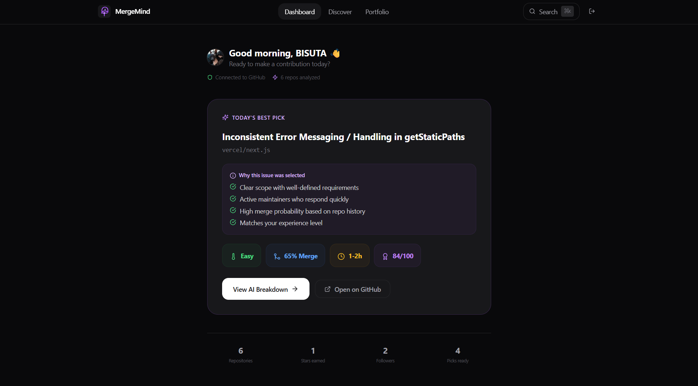
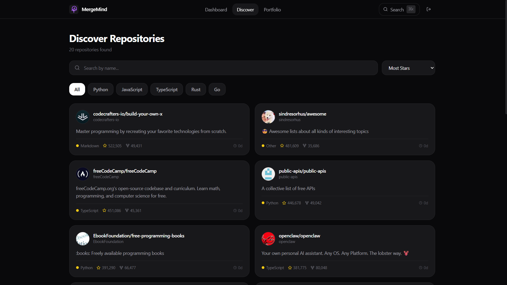
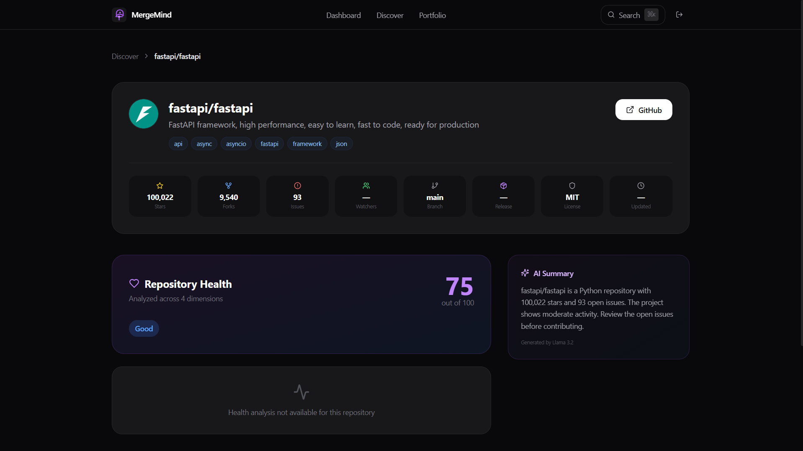
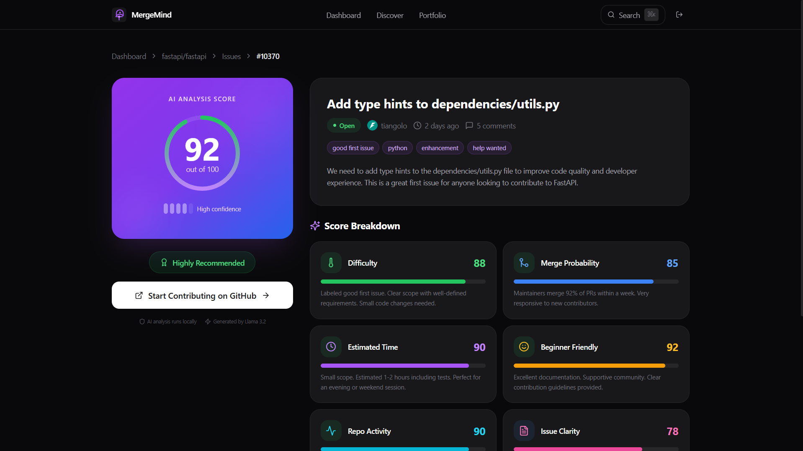
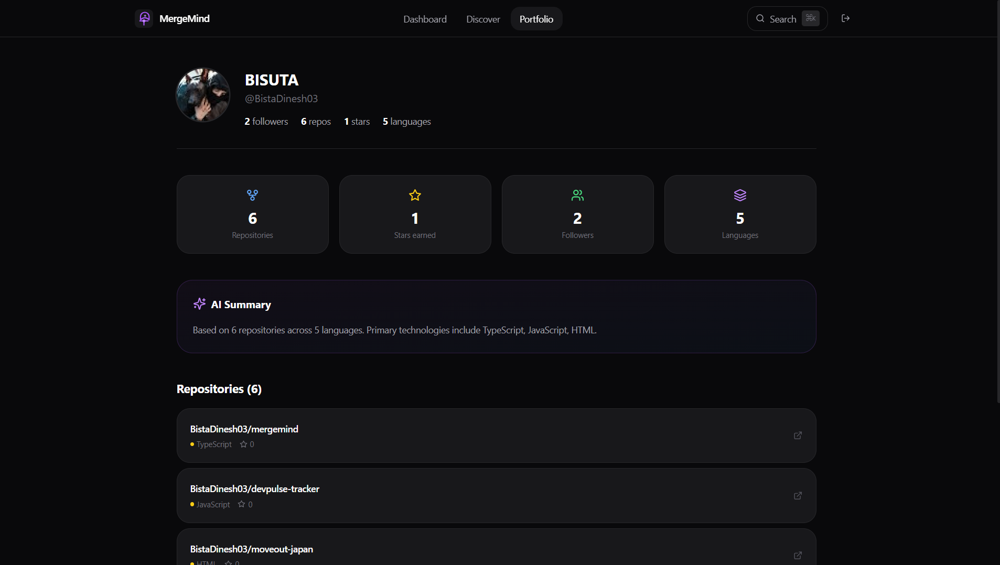

<div align="center">


<br />
<br />

# MergeMind

### Stop searching. Start contributing.

AI analyzes thousands of repositories and tells you exactly which GitHub issue to work on next — in seconds, not hours.


<br />

[](LICENSE)
[](https://github.com/BistaDinesh03/mergemind/stargazers)
[](https://nextjs.org)
[](https://fastapi.tiangolo.com)
[](https://docker.com)
[]()
[]()

</div>

---

## The Problem

You want to contribute to open source. You open GitHub. Millions of issues. Hours of scrolling. You pick one. You submit a PR. It gets ignored or rejected. You try again next weekend.

Most developers never ship their first contribution. Not because they cannot code. Because finding the right issue takes longer than writing the fix.

---

## The Solution

MergeMind scans repositories, scores every open issue across 6 dimensions, and gives you one clear recommendation. Each pick includes a full AI breakdown — difficulty, time estimate, merge probability, and why that issue was chosen for you.

No tabs. No guesswork. One recommendation. One click.

---

## How It Works
Sign in with GitHub
↓
AI scans trending repositories
↓
Every repo receives a health score
↓
Every issue gets scored 0–100
↓
Your top recommendation appears
↓
Review the AI breakdown
↓
Open GitHub and start coding

text

---

## Screenshots



<div align="center">
  
  &nbsp;
  
</div>

<div align="center">
  
  &nbsp;
  
</div>

---

## Features

- **Issue scoring** across difficulty, merge probability, time estimate, beginner friendliness, repository health, and issue clarity
- **Repository health analysis** — activity, documentation, community, and maintenance scores
- **AI Mentor** explains why each issue was selected and what to expect
- **Explainable recommendations** — no black box scores
- **Portfolio builder** from your merged pull requests
- **Command palette** (Cmd+K) to search repositories instantly
- **Dark mode** throughout
- **Accessible** — WCAG 2.2 AA compliant

---

## Architecture

```mermaid
graph LR
    A[Browser] --> B[Next.js 14]
    B --> C[FastAPI]
    C --> D[GitHub API]
    C --> E[Ollama]
    C --> F[(SQLite)]
Layer	Technology
Frontend	Next.js 14, React 18, TypeScript, Tailwind CSS
Backend	FastAPI, Python 3.11, SQLAlchemy, Pydantic
AI Engine	Ollama + Llama 3.2 — local, private, zero cost
Authentication	NextAuth.js + GitHub OAuth 2.0
Database	SQLite (dev), PostgreSQL (prod)
Testing	pytest (16 tests), Vitest, GitHub Actions CI
DevOps	Docker, Docker Compose
Quick Start
bash
git clone https://github.com/BistaDinesh03/mergemind.git
cd mergemind
cp backend/.env.example backend/.env
# Add your GitHub OAuth credentials to backend/.env
docker compose up -d
open http://localhost:3000
Detailed setup in DEPLOYMENT.md.

Project Structure
text
mergemind/
├── backend/              # FastAPI
│   ├── app/routers/      # API endpoints
│   ├── app/services/     # Scoring engines
│   └── tests/            # pytest
├── frontend/             # Next.js
│   ├── app/              # Pages
│   └── components/       # UI
├── docs/                 # Decision records
└── docker-compose.yml
Documentation
Architecture

Deployment

Contributing

Tech Decisions

Roadmap
GitHub OAuth

Repository health scoring

Issue opportunity scoring (6 factors)

AI recommendations with explanations

Portfolio generator

Command palette

WCAG 2.2 AA accessibility

Test suite (16 tests)

Production deployment

PostgreSQL migration

Contribution streaks

VS Code extension

Contributing
See CONTRIBUTING.md. Good first issues available.

License
MIT © BistaDinesh03

<div align="center">
Helping developers spend less time searching and more time contributing.

⭐ Star this repo if you found it useful.

</div> ```
