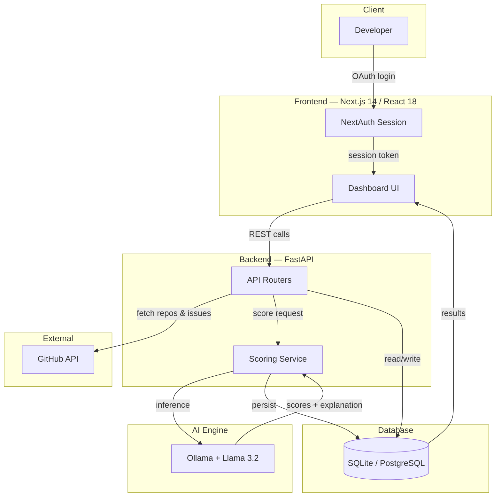

<div align="center">
  

  # MergeMind

  AI-powered GitHub issue recommendation platform.

  [](LICENSE)
  [](https://github.com/BistaDinesh03/mergemind/actions)
  [](https://nextjs.org)
  [](https://fastapi.tiangolo.com)
  [](https://docker.com)
  [](CONTRIBUTING.md)

  

  [Live Demo](https://mergemind-tau.vercel.app/) · [Issues](https://github.com/BistaDinesh03/mergemind/issues)
</div>

<br>

## Contents

[Why](#why) · [Status](#status) · [Features](#features) · [Screenshots](#screenshots) · [Architecture](#architecture) · [Tech stack](#tech-stack) · [Quick start](#quick-start) · [Environment variables](#environment-variables) · [API reference](#api-reference) · [Deployment](#deployment) · [Security](#security) · [Testing](#testing) · [Troubleshooting](#troubleshooting) · [FAQ](#faq) · [Upcoming](#upcoming) · [Contributing](#contributing) · [License](#license)

<br>

## Why

GitHub search and labels tell you what matches a keyword, not what's worth your time. They don't show whether a maintainer responds to PRs, whether an issue's been dead for a year, or whether it's already been attempted and abandoned in the comments. Figuring that out by hand means a dozen open tabs and an hour gone before you've written any code.

MergeMind pulls repository and issue data from GitHub, scores it, and gives you a ranked list with a plain-language reason for each recommendation — difficulty, clarity, and merge probability, not just a label.

<br>

## Status

**v1.0.0** — stable release. GitHub OAuth, repository health analysis, issue scoring, portfolio tracking, and Docker support are all in and working.

<br>

## Features

- **Issue scoring** — difficulty, merge probability, and clarity per issue, so you can skip dead ends before opening them
- **Repository health** — activity, maintenance, and responsiveness signals, so you avoid abandoned repos
- **Explanations** — every recommendation ships with a short reason, not just a score
- **Portfolio** — automatically tracks your merged PRs across repos
- **GitHub OAuth** — sign in with your existing account, nothing new to manage
- **Dark mode**

<br>

## Screenshots

<div align="center">

<br><br>

<br><br>

</div>

<br>

## Architecture



- **Frontend** — renders the dashboard, handles the OAuth session via NextAuth, calls the backend API
- **Backend** — coordinates GitHub data fetching, scoring requests, and persistence
- **GitHub API** — source of repository, issue, and pull request data
- **AI engine** — runs Llama 3.2 through Ollama to score issues and generate explanations, locally, no external inference cost
- **Auth** — GitHub OAuth via NextAuth; issues and encrypts session tokens
- **Database** — stores users, scores, and portfolio history

**How scoring works:** fetch issue and repo metadata from GitHub → extract signals (activity, labels, comment count, issue age) → run through Llama 3.2 via Ollama → produce difficulty, clarity, and merge-probability scores → generate a short plain-language explanation alongside the score → rank and surface in the dashboard. The explanation is what shows up under each recommendation, so if a score looks off, it tells you what the model was weighing.

<br>

## Tech stack

Next.js 14, React 18, TypeScript, Tailwind — FastAPI, Python 3.11, SQLAlchemy — Ollama (Llama 3.2) — NextAuth (GitHub OAuth) — SQLite / PostgreSQL — Docker — GitHub Actions

<br>

## Quick start

```bash
git clone https://github.com/BistaDinesh03/mergemind.git
cd mergemind
cp backend/.env.example backend/.env   # set GITHUB_CLIENT_ID / GITHUB_CLIENT_SECRET
docker compose up -d
open http://localhost:3000
```

**Local development (no Docker):**

```bash
# backend
cd backend
python -m venv venv && source venv/bin/activate
pip install -r requirements.txt
cp .env.example .env
uvicorn app.main:app --reload

# frontend, in a second terminal
cd frontend
npm install
npm run dev

# scoring engine
ollama pull llama3.2
ollama serve
```

<br>

## Environment variables

- `GITHUB_CLIENT_ID`, `GITHUB_CLIENT_SECRET` — from your GitHub OAuth App. Use a separate App registered with your production callback URL when deploying.
- `DATABASE_URL` — SQLite locally (`sqlite:///./mergemind.db`); PostgreSQL in production, since SQLite isn't meant for concurrent load.
- `OLLAMA_HOST` — address of your Ollama instance, e.g. `http://localhost:11434`. Must be reachable from the backend.
- `NEXTAUTH_SECRET` — generate with `openssl rand -base64 32`. Use a fresh value per environment, never reuse a dev secret in prod.
- `NEXTAUTH_URL` — optional locally, required in production (your public HTTPS domain, e.g. `https://mergemind.dev`).

<br>

## API reference

Base URL (local): `http://localhost:8000`. Sample values below illustrate response shape — replace with real data from your instance.

**`GET /api/health`**
```json
{ "status": "ok", "version": "1.0.0" }
```

**`GET /api/repositories`** — list analyzed repositories
```json
{
  "repositories": [
    { "id": "repo_123", "full_name": "owner/example-repo", "health_score": 82, "last_analyzed": "2026-07-01T12:00:00Z" }
  ]
}
```

**`POST /api/repositories/analyze`** — run health analysis on a repository
```json
// request
{ "repo_url": "https://github.com/owner/example-repo" }
```
```json
// response
{
  "id": "repo_123",
  "full_name": "owner/example-repo",
  "health_score": 82,
  "signals": { "activity": "high", "maintainer_responsiveness": "medium", "open_issue_count": 47 }
}
```

**`GET /api/issues/{repo_id}`** — list scored issues for a repository
```json
{
  "issues": [
    {
      "id": "issue_456",
      "title": "Fix pagination bug in search results",
      "difficulty": "easy",
      "merge_probability": 0.78,
      "explanation": "Small, well-scoped bug with a clear reproduction case and an active maintainer."
    }
  ]
}
```

**`GET /api/recommendations`** — fetch the current top recommendation
```json
{ "issue_id": "issue_456", "repo": "owner/example-repo", "score": 0.78, "reason": "High merge probability, low difficulty, active maintainer." }
```

**`GET /api/portfolio`** — fetch a user's contribution portfolio
```json
{
  "user": "octocat",
  "merged_pull_requests": [
    { "repo": "owner/example-repo", "pr_number": 128, "merged_at": "2026-06-15T09:32:00Z" }
  ]
}
```

**`POST /api/auth/callback`** — GitHub OAuth callback, invoked by NextAuth. Not intended to be called directly.

<br>

## Deployment

```bash
cp backend/.env.example backend/.env.production
# set DATABASE_URL, NEXTAUTH_URL, NEXTAUTH_SECRET, GITHUB_CLIENT_ID/SECRET as above
docker compose -f docker-compose.prod.yml up -d
```

Put the app behind a reverse proxy (Caddy, Nginx, Traefik) for TLS. Ollama needs to be reachable from the backend container — run it on the same host or point `OLLAMA_HOST` at a remote instance. Both the backend and Ollama are CPU/memory sensitive under load; size accordingly if scoring many repos concurrently.

<br>

## Security

Auth goes through GitHub OAuth — MergeMind never sees your password. Session tokens are encrypted with `NEXTAUTH_SECRET`. Scoring runs locally through Ollama, so issue and repo data never leaves your infrastructure. Report vulnerabilities privately rather than as a public issue.

<br>

## Testing

```bash
cd backend && pytest
cd frontend && npm run test
```

Include tests with any PR that touches scoring logic, API routes, or shared UI.

<br>

## Troubleshooting

- **Scoring requests hang or time out** — Ollama isn't running or isn't reachable. Confirm `ollama serve` is up and `OLLAMA_HOST` is correct.
- **OAuth login redirects to an error page** — client ID/secret mismatch, or the callback URL on your GitHub OAuth App doesn't match `NEXTAUTH_URL`.
- **`docker compose up` fails on the backend** — usually a missing or malformed `.env` file. Confirm it exists and was copied from `.env.example`.
- **Empty issue list for an analyzed repo** — either the repo has no open issues, or you've hit a GitHub API rate limit. Wait and re-run analysis.

**Known limitations:** scoring depends on Llama 3.2 and will occasionally misjudge scope on unusual issues; SQLite isn't meant for concurrent production load; Ollama must be running for scoring to work, with no hosted fallback yet; heavy analysis across many repos can hit GitHub rate limits.

<br>

## FAQ

**Does it cost anything to run?** No paid API required — scoring runs locally through Ollama. You cover your own GitHub OAuth App and hosting.

**Do I need a GPU?** No, but scoring is faster with one.

**Can I swap in a different model?** In principle, any Ollama-supported model — prompts are currently tuned for Llama 3.2.

**Is my GitHub data sent anywhere?** No. Repos and issues are fetched from the GitHub API and scored locally by your own Ollama instance.

<br>

## Upcoming

- Production hosting guide, PostgreSQL migration for hosted instances
- Demo walkthrough video
- Browser extension

<br>

## Contributing

```bash
git checkout -b feature/short-description
# feat: add issue difficulty filter to dashboard
```

Run `pytest` and `npm run test` before opening a PR, and make sure the description explains what changed and why. Issues labeled `good first issue` are a good place to start.

<br>

## License

MIT © [BistaDinesh03](https://github.com/BistaDinesh03)

<br>

<div align="center">

If MergeMind is useful to you, a star helps others find it.

[Star](https://github.com/BistaDinesh03/mergemind/stargazers) · [Fork](https://github.com/BistaDinesh03/mergemind/fork)

</div>
