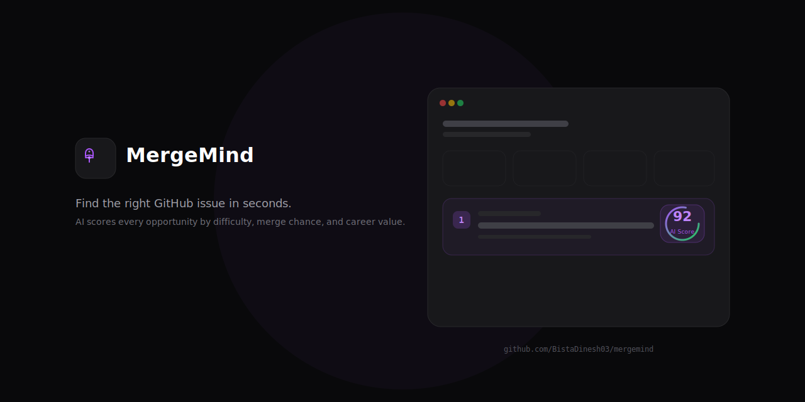

 
 

# MergeMind

### Stop searching. Start contributing.

AI analyzes thousands of repositories and tells you exactly which GitHub issue to work on next — in seconds, not hours.

 

---

## The Problem

You want to contribute to open source. You open GitHub. Millions of issues. Hours of scrolling. You pick one. You submit a PR. It gets ignored. You try again next weekend.

Most developers never ship their first contribution. Not because they cannot code — because finding the right issue takes longer than writing the fix.

---

## The Solution

MergeMind scans repositories, scores every open issue across 6 dimensions, and gives you one clear recommendation. Each pick includes a full AI breakdown — difficulty, time estimate, merge probability, and why that issue was chosen for you.

---

## How It Works

Sign in with GitHub → AI scans repositories → Every issue scored 0-100 → Your top recommendation appears → Review the AI breakdown → Open GitHub and start coding.

---

## Features

- Issue scoring across difficulty, merge probability, time, beginner friendliness, repo health, and clarity
- Repository health analysis — activity, documentation, community, maintenance
- AI Mentor explains why each issue was selected
- Portfolio builder from merged PRs
- Command palette (Cmd+K)
- Dark mode, accessible (WCAG 2.2 AA)

---

## Quick Start

git clone https://github.com/BistaDinesh03/mergemind.git
cd mergemind
docker compose up -d
open http://localhost:3000

---

## Documentation

- [Architecture](ARCHITECTURE.md)
- [Deployment](DEPLOYMENT.md)
- [Contributing](CONTRIBUTING.md)
- [Tech Decisions](docs/DECISIONS.md)

---

## License

MIT © BistaDinesh03

---

Helping developers spend less time searching and more time contributing.
 
<a href="https://github.com/BistaDinesh03/mergemind">⭐ Star this repo</a>

