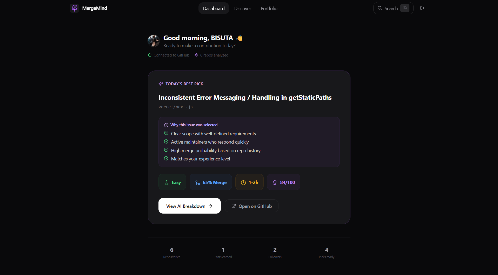
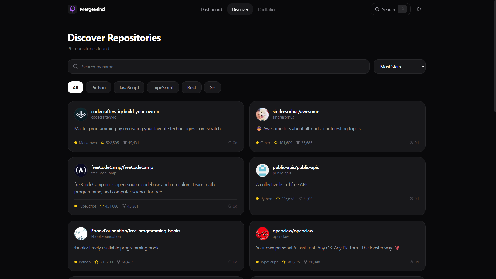
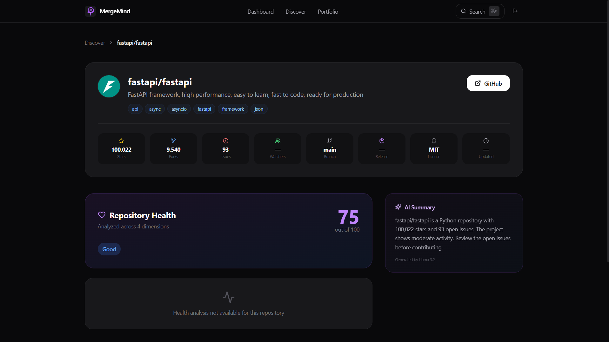

<div align="center">
  

  # MergeMind

  Find your first open source contribution in minutes.

  [](LICENSE)
  [](https://github.com/BistaDinesh03/mergemind/actions)
  [](https://nextjs.org)
  [](https://fastapi.tiangolo.com)
  [](https://docker.com)
  [](CONTRIBUTING.md)

  [Live Demo](https://mergemind-tau.vercel.app) · [Issues](https://github.com/BistaDinesh03/mergemind/issues)
</div>

<br>

## Why

Searching GitHub for beginner-friendly issues is frustrating. You spend hours reading long threads, guessing difficulty, and figuring out setup — often giving up before making any progress.

MergeMind scans GitHub issues, scores them with AI, and gives you a ranked list with a plain-language reason for each recommendation — difficulty, clarity, and merge probability, not just a label.

<br>

## Features

- **AI-Matched Issues** — Google Gemini finds beginner-friendly issues that match your languages and skill level, with a short explanation for each match
- **Repository Health Scores** — see which projects are active, well-documented, and welcoming to new contributors before you invest time
- **Step-by-Step Guide** — interactive checklist from fork to merged PR with copyable terminal commands
- **GitHub OAuth Login** — sign in with your existing GitHub account, nothing new to manage
- **Portfolio Tracking** — browse your repositories, languages, and contribution history in one place
- **Progress Tracking** — keep track of issues you've viewed, saved, started, and completed

<br>

## Screenshots

<div align="center">

**Dashboard**


<br>

**Discover**


<br>

**Repository Analysis**


</div>

<br>

## Tech Stack

| Layer | Technology |
|-------|-----------|
| Frontend | Next.js 15 · React · TypeScript · Tailwind CSS |
| Backend | FastAPI · Python 3.11 |
| Database | PostgreSQL (production) · SQLite (development) |
| Authentication | GitHub OAuth · NextAuth.js |
| AI | Google Gemini 2.5 Flash |
| Deployment | Vercel (frontend) · Railway (backend) |
| Container | Docker · Alpine Linux |

<br>

## Quick Start

```bash
git clone https://github.com/BistaDinesh03/mergemind.git
cd mergemind
cp backend/.env.example backend/.env          # fill in your tokens
cp frontend/.env.local.example frontend/.env.local
docker compose up -d
```

Open `http://localhost:3000`. Backend runs on `http://localhost:8000`.

<br>

## Environment Variables

- `GITHUB_CLIENT_ID`, `GITHUB_CLIENT_SECRET` — from your GitHub OAuth App
- `GEMINI_API_KEY` — Google Gemini API key used for issue scoring and explanations
- `DATABASE_URL` — SQLite locally, PostgreSQL in production
- `NEXTAUTH_SECRET` — generate with `openssl rand -base64 32`
- `NEXTAUTH_URL` — required in production (your public HTTPS domain)

<br>

## Project Structure

```
mergemind/
├── frontend/           # Next.js app (TypeScript + Tailwind)
│   └── app/            # App Router pages and components
├── backend/            # FastAPI app (Python)
│   └── app/
│       ├── routers/    # API endpoints
│       ├── services/   # Business logic (GitHub, Gemini, scoring)
│       └── models/     # Database models
└── docker-compose.yml  # Local development
```

<br>

## Deployment

```bash
cp backend/.env.example backend/.env.production
# set DATABASE_URL, NEXTAUTH_URL, NEXTAUTH_SECRET, GITHUB_CLIENT_ID/SECRET, GEMINI_API_KEY
docker compose -f docker-compose.prod.yml up -d
```

Frontend deploys to Vercel, backend to Railway. Put the backend behind HTTPS and set `NEXTAUTH_URL` to your public domain.

<br>

## Security

Auth goes through GitHub OAuth — MergeMind never sees your password. Session tokens are encrypted with `NEXTAUTH_SECRET`. Please report vulnerabilities privately rather than as a public issue — see [SECURITY.md](SECURITY.md).

<br>

## Documentation

- [Architecture](docs/ARCHITECTURE.md)
- [API Documentation](docs/api/README.md)
- [Deployment Guide](docs/DEPLOYMENT.md)
- [Security Policy](SECURITY.md)

<br>

## Contributing

We welcome contributions — especially from first-time open source contributors.

See [CONTRIBUTING.md](CONTRIBUTING.md) for setup, branch naming, commit conventions, and how to find your first issue.

<br>

## License

MIT © [Dinesh Bista](https://github.com/BistaDinesh03)

<br>

<div align="center">

If MergeMind is useful to you, a star helps others find it.

[Star](https://github.com/BistaDinesh03/mergemind/stargazers) · [Fork](https://github.com/BistaDinesh03/mergemind/fork)

</div>
